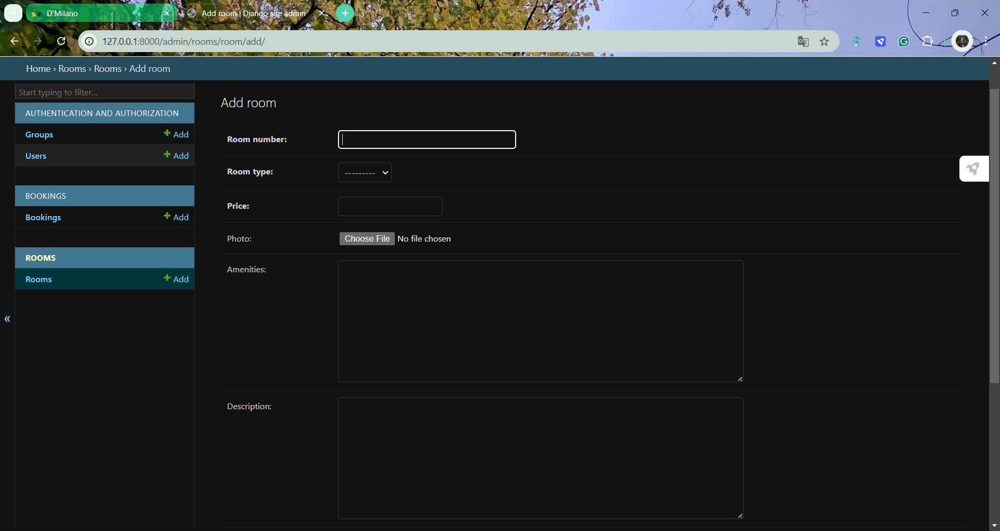

# Hotel Booking Management Application

A Django-based application for managing hotel bookings, rooms, and customer profiles. This project includes features for booking management, customer profile handling, and room availability tracking.

## Table of Contents
- [Features](#features)
- [Project Structure](#project-structure)
- [Installation](#installation)
- [Usage](#usage)
- [API Endpoints](#api-endpoints)
- [Screenshots](#screenshots)
- [License](#license)

## Features
- **Bookings**: Create, view, and manage hotel bookings, with check-in and check-out functionality.
- **Rooms**: Manage room information, including room availability, type, and pricing.
- **Customer Profiles**: Allow customers to create and edit profiles.
- **Admin Panel**: Provides an interface for hotel staff to manage bookings, customers, and rooms.

## Project Structure
```plaintext
DjangoProject/
├── bookings/           # Booking-related models, views, and serializers
├── djangoProject/      # Main Django project settings
├── media/              # Media files (user-uploaded content)
├── profiles/           # Customer profile management
├── rooms/              # Room management
├── templates/          # HTML templates
├── manage.py           # Django command-line utility
└── db.sqlite3          # SQLite database (for development)
```

## Installation

### Prerequisites
- Python 3.x
- Django
- Git

### Steps
1. **Clone the Repository**:
   ```bash
   git clone https://github.com/itsRiddhiPandey/Hotel-Booking-Management-Application.git
   cd Hotel-Booking-Management-Application
   ```

2. **Create a Virtual Environment**:
   ```bash
   python -m venv env
   source env/bin/activate         # On macOS/Linux
   .\env\Scripts\activate          # On Windows
   ```

3. **Install Dependencies**:
   ```bash
   pip install -r requirements.txt
   ```

4. **Apply Migrations**:
   ```bash
   python manage.py migrate
   ```

5. **Create a Superuser** (for admin access):
   ```bash
   python manage.py createsuperuser
   ```

6. **Run the Server**:
   ```bash
   python manage.py runserver
   ```

7. **Access the Application**:
   - Open a browser and go to [http://127.0.0.1:8000/](http://127.0.0.1:8000/).

## Usage

1. **Admin Panel**:
   - Access the admin interface at `/admin`.
   - Log in with the superuser account you created.
   - Manage bookings, rooms, and profiles from this interface.

2. **Booking and Room Management**:
   - Use the app to create and manage bookings, check room availability, and update booking details.

3. **Customer Profiles**:
   - Customers can create and edit their profiles on `/profile/` and `/profile/edit/`.

## API Endpoints

| Endpoint                  | HTTP Method | Description                        |
|---------------------------|-------------|------------------------------------|
| `/bookings/`              | GET, POST   | List all bookings or create a new booking |
| `/rooms/`                 | GET         | List all rooms                    |
| `/rooms/<int:id>/`        | GET, PUT    | Retrieve or update room details   |
| `/profile/`               | GET, PUT    | Retrieve or update customer profile |

> **Note**: Update the endpoints based on your project’s specific routing.

## Screenshots

Add screenshots of your application in this section to give users a quick preview of the functionality and UI. Place images in a `screenshots/` folder in your project directory and reference them as shown below.

Example:

- **Home Page**: 


- **User Profile [Sign Up and Login]**:


- **Room Details**: 


- **Booking Page**:


- **Admin Panel:** Screenshot of the admin dashboard for managing bookings and rooms.




## License
This project is licensed under the MIT License.

---
